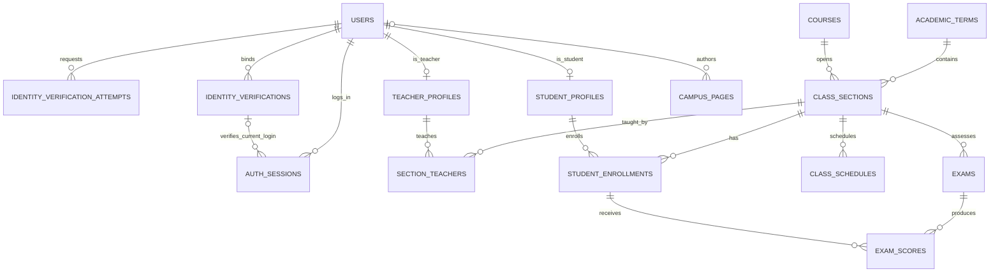
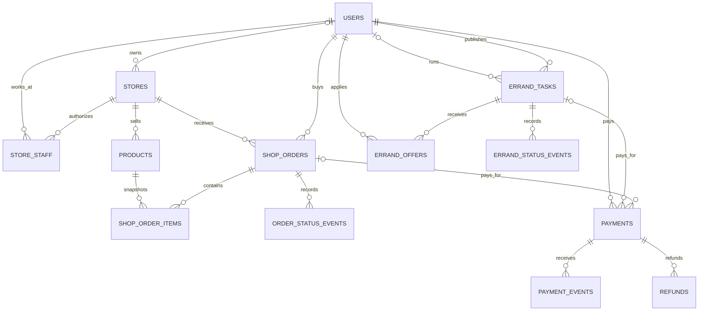
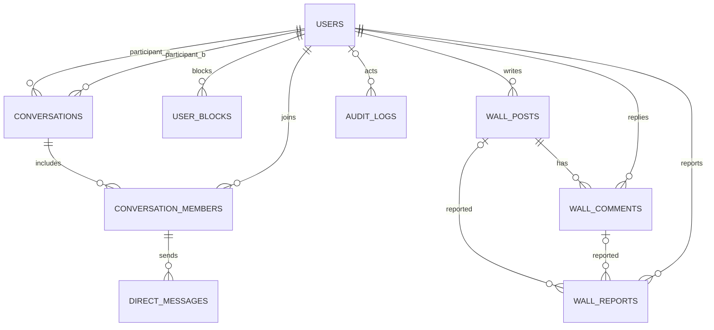
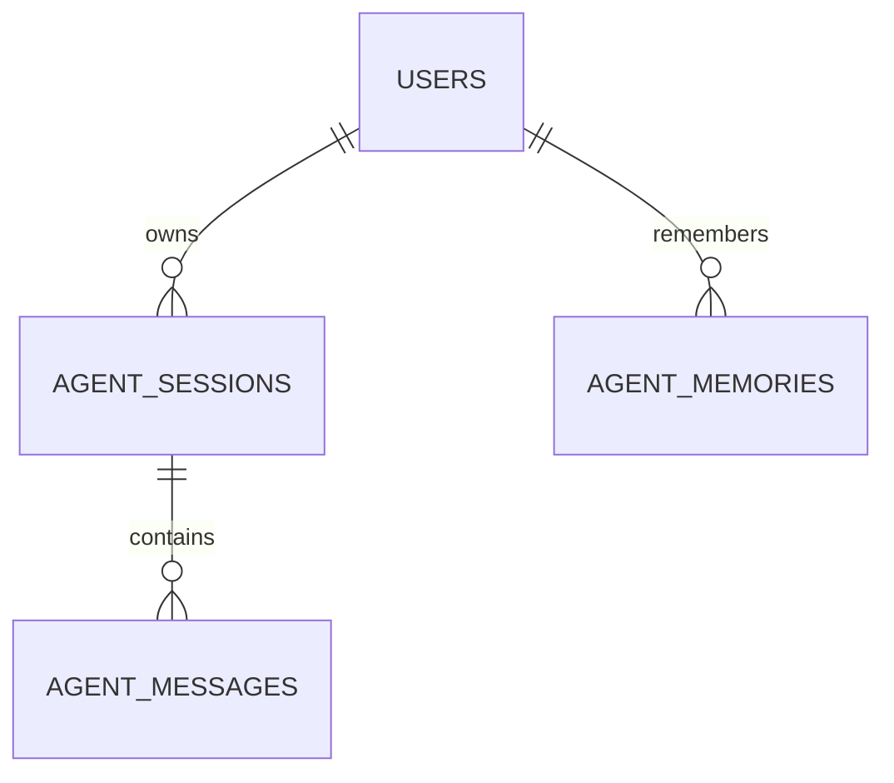

# 校园综合服务平台：需求与数据库设计 v1

本次交付覆盖需求分析、ER 图、完整 PostgreSQL DDL 和数据库权限设计。校园业务 API 仍未全部实现；数据库结构已通过正式迁移 `004_frontend_auth_compat.sql` 至 `009_frontend_domain_completion.sql` 应用到当前 `app_dev`。本目录仅提供数据库层，应用服务由其他项目实现。

## 1. 交付文件与使用边界

- `db/design/campus-platform.full.sql`：可在空数据库执行的完整 DDL，包含 **66 张业务表**（已有 6 张 + 校园业务表及前端配套表）、索引、约束、触发器、权限策略及公开安全视图。
- `db/migrations/008_frontend_supporting_data.sql`：补充前端交接清单中的地点、活动、闲置、收藏、上传、好友和心理支持请求表及 RLS。
- `db/migrations/009_frontend_domain_completion.sql`：补充前端实际使用的点赞、浏览足迹、地点收藏、用户偏好、好友关系/备注、闲置订单、校园位置与通知、AI 对话、教师授权个案及干预记录表和 RLS。
- `scripts/build-campus-ddl.mjs`：从正式迁移重新生成完整 SQL。
- `tests/campus-design.test.mjs`：在随机命名临时数据库执行完整 DDL 和权限测试，测试后清理临时库。

SQL 面向 PostgreSQL 18。完整文件只允许在空数据库由项目迁移管理员执行；已存在的 `app_backend`/`app_agent` 数据库角色会复用，不重置密码。新集群缺少角色时只创建 NOLOGIN 最小角色，登录凭据和数据库 CONNECT 权限需由部署流程配置。该文件不写现有迁移账本，因此不要对设计库直接执行原项目 `db:init`。

```powershell
npm.cmd run design:build
npm.cmd run design:test
```

测试会连接 `.env` 指定的 PostgreSQL 集群创建临时数据库，不创建新项目副本，不修改 `app_dev` 的表或业务数据。所有设计表均位于 `app` schema。金额统一为人民币分，时间使用 `timestamptz`；公开时间、课程节次和学期日期按学校所在地 `Asia/Shanghai` 解释。

## 2. 需求范围及默认决定

### 2.1 统一身份，四种业务角色

每个账号本期只有一个主角色：`guest / student / teacher / admin`。身份改变由可信核验或管理员授权流程完成，注册接口不能让用户自行指定管理员角色。一个用户多重学籍、多个学校以及教师兼学生不在本期范围；以后需要时应新增成员身份表，而不是直接叠加 role 字符串。

- **游客**：不登录也可浏览已发布校园介绍、店铺、商品及表白墙。APP 的“游客登录”可建立 `guest_sessions`，只用来记录短期匿名会话，不是普通用户登录，不获得个人数据权限；不强迫游客注册账号。
- **学生**：通过校内学籍绑定及真人核验，且当前登录具有有效核验凭证后，查看本人信息、本人已选课程课表、本人成绩；成绩还必须已发布。
- **教师**：通过教职工身份绑定及真人核验后查看本人教师信息和本人授课课表。**教师角色不自动获得学生成绩查询或修改权限。** 用户本期未要求教师录入成绩，因此不添加该能力。
- **管理员**：管理校园内容、身份审核、商店配置、运营订单和表白墙审核。**管理员身份不自动获得学生成绩、个人课表、个人学籍资料或私信正文的查询权限。** 教务导入由受审计的专用作业处理，不能复用普通管理员页面越权查看。

商家和跑腿员不是第五、第六种主角色：商家权限来自 `stores.owner_id` / `store_staff`，跑腿员是已核验用户在具体任务中的参与身份。默认学生和教师可购买、跑腿和社交，游客只能浏览。

### 2.2 真人核验与本次登录

分三层记录：

1. `identity_verification_attempts`：一次外部核验请求及结果，不把身份证照片、人脸影像、完整证件号码写入数据库。
2. `identity_verifications`：账号与学生/教师身份的当前绑定，保存认证状态、有效期、可信提供方及 HMAC 去重值。
3. `auth_sessions.authenticated_identity_id / identity_authenticated_at / identity_valid_until`：**当前登录**完成核验的证明和到期时间。复合外键保证不能使用另一个用户的认证记录。

历史核验通过、本次登录未核验、凭证过期、学籍认证过期或账号停用，都不能读取教务数据。每次是否调用活体检测、校园 SSO 是否能代表足够强度的真人认证，需要学校和认证服务提供方确认；这些表本身不执行人脸识别，也不能凭一条 `verified` 数据宣称已经实现活体认证。

原库旧 `user` 账号在迁移时映射为 `guest`，**不自动认定为学生**；新角色默认 guest。已有管理员仍为 admin。该角色兼容迁移已通过 `004_frontend_auth_compat.sql` 应用。

### 2.3 各模块业务约定

| 模块 | 本期数据库范围 | 约定 |
| --- | --- | --- |
| 校园介绍 | 概述、面向新生/备考学生的页面、发布状态 | 草稿不可公开，定时发布到时间才显示 |
| 教务 | 学期、课程、教学班、教师、选课、周课表、考试、成绩 | 学生只看本人，教师只看本人授课安排；无学生名单/成绩扩权 |
| 校园商店/小吃街 | 店铺、工作人员、商品、单店订单、明细、支付、退款、状态事件 | 跨店购物拆单；价格/名称保留成交快照 |
| 校园跑腿 | 任务、接单申请、选定接单人、履约状态、支付关联 | 先申请、发布人选定一人；单任务最多一个 accepted 申请 |
| 私信 | 两人会话、成员、加密消息、已读时间、拉黑 | 不做群聊；管理员不能默认读取正文 |
| 表白墙 | 帖子、评论、匿名展示、审核、举报 | 默认先审核后公开；匿名对普通浏览者隐藏身份，不对作者本人/审核员匿名 |

“订单管理”包括买家查看本人订单、商家查看自己店铺订单及管理任务状态。支付供应商、配送能力和真实资金结算尚未接入；DDL 只建立可靠的持久化模型。

## 3. ER 图

### 3.1 账号、认证及教务



`GUEST_SESSIONS` 独立于用户与教务关系；`CRYPTO_SETTINGS` 是已有密钥验证记录。核验绑定和学生/教师资料由延迟约束触发器在事务提交时检查与最终用户角色一致。

### 3.2 商城、跑腿和支付



每条支付只能关联商城订单或跑腿任务其中一个；支付人必须是买家/发布人且金额匹配。订单与明细、明细与商品使用带 `store_id` 的复合外键，防止跨店串单。

### 3.3 私信与表白墙



会话用按 UUID 排序的 `(participant_a, participant_b)` 唯一键避免 A→B 和 B→A 重复；会话参与人不可更换。成员表只能插入这两人，消息发送者必须是活跃成员，拉黑关系阻止新消息。会话建立即需在同一事务为双方插入成员行，未插入的成员无法读取。

举报必须且只能指向一个帖子或评论。匿名公开视图通过 `CASE` 隐去作者 ID 与昵称；原表不会向普通浏览者开放他人的作者映射。

### 3.4 保留的 Agent 数据



Agent 继续独立连接数据库。新增校园域只授予安全的公开视图，**不默认授予成绩、学籍、核验、订单、私信的读取权限**。后续若确有个人数据工具需求，必须另行设计绑定用户身份的最小授权接口。

## 4. 所有数据表清单

下列字段是阅读索引，**具体字段、数据类型、默认值、外键、唯一约束、CHECK、触发器和 GRANT 以完整 DDL 为准**。

### 4.1 身份与原有基础表（10 张）

| 表 | 主键 | 主要字段与关系 |
| --- | --- | --- |
| `users` | UUID id | 邮箱密文、邮箱 HMAC、密码哈希、公开昵称、四种 role、status、私密资料密文 |
| `auth_sessions` | token_hash | user_id、csrf_token、expires_at、web/ios/android、认证绑定 ID、本次核验时间及有效期 |
| `crypto_settings` | singleton | 已有加密密钥/查找密钥验证记录，不保存原密钥 |
| `agent_sessions` | UUID id | user_id、agent_key、上下文 JSON、摘要、状态 |
| `agent_messages` | bigint id | session_id + user_id 复合外键、role、content、metadata |
| `agent_memories` | UUID id | user_id + agent_key + memory_key 唯一、内容、重要度、过期时间 |
| `guest_sessions` | token_hash | 客户端类型、创建与到期时间；与 users 无外键 |
| `identity_verifications` | UUID id | user_id、student/teacher、姓名密文、凭据 HMAC、provider、状态、审核人、有效期 |
| `identity_verification_attempts` | UUID id | user_id、申请角色、provider/request_id 唯一、核验结果、加密证据引用 |
| `audit_logs` | bigint id | actor_id、action、resource_type、文本 resource_id、去敏 metadata、IP 哈希、时间 |

### 4.2 校园内容与教务（11 张）

| 表 | 主键 | 主要字段与关系 |
| --- | --- | --- |
| `campus_pages` | UUID id | slug 唯一、标题、摘要、结构化正文、受众、发布状态、发布时间 |
| `student_profiles` | user_id | 学号密文/HMAC 唯一、学院、专业、年级、行政班、学籍状态 |
| `teacher_profiles` | user_id | 工号密文/HMAC 唯一、学院、职称、任职状态 |
| `academic_terms` | UUID id | code 唯一、名称、起止日期、状态 |
| `courses` | UUID id | code 唯一、名称、学分、描述、学院 |
| `class_sections` | UUID id | term_id、course_id、section_code 联合唯一、容量、状态 |
| `section_teachers` | section_id + teacher_id | 教师资料外键；每班最多一个主讲教师 |
| `student_enrollments` | section_id + student_id | 已选/退课/完成、选课时间 |
| `class_schedules` | UUID id | 教学班、星期、起始节、节数、起止周、单双周、地点 |
| `exams` | UUID id | 教学班、考试名/类型、时间、地点、满分、状态 |
| `exam_scores` | exam_id + student_id | 复合外键绑定考试所属教学班与学生选课、分数、等级、反馈、发布和录入记录 |

课表是按选课关系计算出来的“本人课表”，不为 Web 和 APP 各存一份。临时调课、补考、多次成绩尝试、教学楼字典及排课冲突检测不在当前 v1 范围；这些需要后续教务接入需求确认。

### 4.3 商城、跑腿和财务（12 张）

| 表 | 主键 | 主要字段与关系 |
| --- | --- | --- |
| `stores` | UUID id | 店名、校园商店/小吃街、介绍、地点、owner_id、营业状态 |
| `store_staff` | store_id + user_id | manager/clerk、启用状态 |
| `products` | UUID id | store_id、名称、描述、图片引用、单价分、库存、上下架状态 |
| `shop_orders` | UUID id | buyer_id、store_id、订单状态、支付状态、总额分、地址/电话密文、用户幂等 request_key |
| `shop_order_items` | bigint id | order/store/product 外键、成交商品名/单价快照、数量 |
| `order_status_events` | bigint id | order_id、操作者、前后状态、原因、时间 |
| `errand_tasks` | UUID id | 发布人、选定接单人、标题、公开区域、私密描述、加密取送地点/联系人、赏金、截止时间、状态、幂等键 |
| `errand_offers` | task_id + runner_id | 接单申请、留言、pending/accepted/rejected/withdrawn |
| `errand_status_events` | bigint id | task_id、操作者、前后状态、原因、时间 |
| `payments` | UUID id | order_id/task_id 二选一、payer_id、金额/币种、提供方、交易号、幂等键、状态 |
| `payment_events` | bigint id | payment_id、provider/event_id 唯一、回调摘要、处理时间 |
| `refunds` | UUID id | payment_id、幂等键、退款金额、原因、状态、第三方退款号、完成时间 |

退款预留中的 pending 与已成功退款合计不能超过原支付金额，触发器锁定支付行进行校验。同一订单/任务最多一条成功或已退款支付记录；重试失败支付可产生新记录。金额不使用浮点。

### 4.4 社交（7 张）

| 表 | 主键 | 主要字段与关系 |
| --- | --- | --- |
| `conversations` | UUID id | 两个不可变参与人、有序用户对唯一、创建人、创建时间 |
| `conversation_members` | conversation_id + user_id | 加入、退出、已读时间；成员必须属于参与人对 |
| `direct_messages` | bigint id | 会话、发送者、密文正文、类型、用户幂等消息 ID、发送/撤回时间 |
| `user_blocks` | blocker_id + blocked_id | 单向拉黑、禁止拉黑自己 |
| `wall_posts` | UUID id | 作者、标题、正文、匿名标记、审核状态、时间 |
| `wall_comments` | bigint id | post_id、作者、正文、匿名标记、审核状态、时间 |
| `wall_reports` | bigint id | 举报人、帖子/评论二选一、原因、处理状态、处理人 |

消息的图片/文件由未来文件服务处理，密文内容保存受控对象引用；不在数据库保存大块二进制文件或公开可访问的私密附件 URL。当前只提供位置字段设计，尚未实现附件服务。

## 5. 权限矩阵

| 资源 | 游客/未核验 | 已核验学生 | 已核验教师 | 管理员 |
| --- | --- | --- | --- | --- |
| 已发布校园介绍/店铺/商品 | 只读安全公开字段 | 同左 | 同左 | 管理公开内容 |
| 核验状态 | 登录用户仅本人结果 | 本人 | 本人 | 审核 |
| 本人学生/教师资料 | 禁止 | 仅本人学生资料 | 仅本人教师资料 | 无默认读取 |
| 成绩 | 禁止 | 本人、已选课、已发布 | 禁止 | 禁止 |
| 课表/考试安排 | 禁止 | 本人选课 | 本人授课 | 无默认读取 |
| 商城订单 | 禁止 | 本人订单；商家需额外绑定 | 同左 | 运营管理 |
| 跑腿任务 | 禁止 | 开放任务摘要；参与者看详情 | 同左 | 运营管理 |
| 私信 | 禁止 | 本人活跃会话 | 本人活跃会话 | 无默认读取 |
| 表白墙 | 公开视图只读 | 提交待审核内容、举报 | 同左 | 审核、可追溯作者 |
| Agent 新增域访问 | — | 不代表用户自动扩权 | 同左 | — |

### 5.1 RLS 的具体实现

- 新增 34 张表启用并强制 RLS，没有匹配策略时拒绝访问。公共数据库角色并不等于游客，前端永远不拿数据库账号。
- 每个后端请求在同一事务、同一连接内设置 `app.user_id` 和 `app.session_hash`（认证令牌 SHA-256 的十六进制值）；后者必须与仍然有效的登录会话及 user_id 相符。
- 角色来自数据库 `users.role`，核验状态来自认证绑定及当前会话，不信任 `app.user_role` 或请求体中的 role/userId。伪造 role 字符串不会提升权限。
- `request_verified()` 同时验证当前账号、绑定类型、认证有效期及本次登录的有效核验凭证。成绩策略额外限制 `student_id=current_user_id`、选课关系和 published_at。
- 私信成员判断使用固定 search_path 的 SECURITY DEFINER 辅助函数，避免成员表 RLS 查询自身导致递归；这些函数没有动态 SQL、不接受任意 userId、默认 PUBLIC 执行权已撤销。
- 辅助函数和公开视图由受信任迁移管理员拥有（本项目 postgres），运行账号不得成为它们的 owner，不得被授予超级用户或 BYPASSRLS。

**信任边界**：这仍然是服务端共享数据库账号方案，可信后端必须验证真实 Cookie/令牌后才能设置会话变量。已有登录数据表对 `app_backend` 保留认证所需权限，不能把原始 SQL、数据库密码或更改会话变量的工具交给客户端/模型。管理员在产品层不能看个人教务和私信，但数据库运维超级用户仍具有运维访问能力，RLS 不能隔离超级用户。

### 5.2 六个安全读取视图

| 视图 | 输出范围 |
| --- | --- |
| `campus_public_pages` | 已发布且到发布时间的校园内容，不返回管理字段 |
| `public_stores` | 营业店铺，不返回 owner_id |
| `public_products` | 营业店铺的在售商品 |
| `wall_public_posts` | 已发布帖子；匿名作者 ID 为 NULL，昵称为“匿名用户” |
| `wall_public_comments` | 已发布帖子下的已发布评论，匿名规则同上 |
| `errand_open_list` | 已核验用户可看未过期开放任务摘要，不包含发布人、私密描述或精确取送信息 |

前五个视图授予后端和 Agent SELECT；跑腿摘要只授予后端。原始帖子/评论表只允许作者或审核员读取，不能用原表做公开列表。视图使用 security_barrier 并明确筛选字段，不能改成 `SELECT *`。

### 5.3 写权限分阶段开放

DDL 已允许受约束的待审核发帖/评论、本人举报、会话成员发消息、本人拉黑，以及有限管理员配置操作。**下单、扣库存、接单、创建会话成员、支付回调、真人核验回调、审计写入、教务导入等复杂写操作暂未授予通用服务直接写权限**，后续 API 阶段应通过严格限定的事务能力或单独作业角色实现，不能简单给 app_backend 增加全部表的全权限。

基础 DDL 是数据和权限契约，不等于上述业务已经能从页面操作。不得为方便调试把当前用户伪装为管理员来完成学生/教师下单或聊天建会话。

## 6. 数据一致性与事务约定

已经由数据库约束/触发器保证：

- 学号/工号 HMAC 唯一，身份绑定与用户角色匹配；当前登录认证不能引用别人的记录。
- 学生成绩同时属于该考试所属班级和该学生选课关系，分数不超过考试满分；降低满分不能低于已有分数。
- 商品与订单明细属于同一店铺；商品库存和金额非负；幂等订单/消息/支付/回调键唯一。
- 任务不能自接；一个 accepted 申请；选定接单人和 accepted 申请必须在事务提交时一致。
- 私聊用户对唯一、第三人不能加入；消息发送者是活跃成员且双方没有拉黑关系。
- 退款需要成功支付，并限制累计 pending/succeeded 退款金额。
- 举报只有一个目标，匿名公开视图不泄露作者 ID。

**后续 API 必须实现的事务工作**（当前尚未实现）：

1. 下单锁定商品行，校验在售/库存，用服务端价格创建成交快照、汇总明细金额、条件扣库存并创建订单；金额不能取客户端传值。当前 DDL 不通过跨行 CHECK 自动汇总订单总额。
2. 订单/任务状态迁移使用当前状态条件更新或行锁，合法状态边定义在业务服务；状态枚举只约束取值，不代表已实现状态机。
3. 接单锁任务行，在同一事务更新申请 accepted 和任务 assigned，写状态事件，拒绝重复接单；取消/退款同理。
4. 支付回调先验证第三方签名、商户号、金额及交易归属，以 event_id 幂等处理，再原子更新支付、订单和状态事件。订单金额在创建支付后不得再改；数据库触发器校验支付写入时金额，但完整冻结策略需业务事务配合。
5. 创建私聊时规范参与人顺序，使用唯一键防并发重复，插入双方成员；聊天分页和已读更新不允许篡改其他成员。
6. 核验通过后在事务中变更 role、写入身份/资料、签发本次登录核验凭证；只可信提供方回调或经过授权的人工审核流程能更新结果。认证材料不返回给普通用户，查询结果需输出专门 DTO。
7. 任何高风险写操作都要同时追加 audit/status event；这些表目前不允许普通服务更新/删除，受限 writer 在后续阶段加入。

## 7. 隐私、删除与保留

密码继续使用已有 scrypt；真实邮箱继续使用已有 AES-256-GCM 和 HMAC 查找。新增姓名、学号/工号、收货地址、联系方式、核验证据引用和私信正文采用应用层加密列，AAD 应绑定表/主键/字段，并由密钥管理服务提供版本化密钥；学号/工号的去重 HMAC 应采用专门密钥/域分离。**新增列的加密读写代码本阶段没有实现，测试中的密文只是结构测试占位。** 私信采用服务端可解密加密，不宣称端到端加密。

公开昵称、商品描述、表白墙正文、跑腿任务私密描述以及既有 Agent 上下文/memory 当前不做字段加密；私密描述靠行级权限保护，不能在公开摘要中泄露。数据库备份还应使用受限或加密存储。

教务、订单、支付和社交历史通过 RESTRICT 保留，用户停用优先改 status，不直接物理删除。作者保留是为了审核追溯，匿名不意味着数据库不记录作者。需要注销/去标识化、证据留存期、会话/guest 会话到期清理，应在学校运营规则确认后实现专门流程；当前没有自动删除真实数据。

## 8. 与现有系统集成及下一阶段

当前 `app_dev` 原有 schema 与角色行为保持不变。正式采用该草案前必须同步改造现有 Go 注册/登录、页面角色文案、身份核验和事务注入逻辑；否则旧代码仍按 user/admin 设计，会与新默认 guest 冲突。原 Agent 继续持有独立账号，仅开放必要公开视图。

Web 与 APP 都通过 Go HTTPS API 获取经过权限过滤的 DTO，不直接连接 PostgreSQL。当前 Web 原型已可使用 `/api/v1/auth/login` 的 Bearer 登录兼容接口；完整校园业务 API 仍按模块接入。Web 可以沿用 HttpOnly Cookie + CSRF，APP 使用 Bearer 会话；`auth_sessions.client_kind` 区分两类会话。本阶段不创建另一套 APP 用户表、成绩表或订单表。

下一阶段再输出资源 API/OpenAPI、各角色路由权限矩阵、身份核验集成、受限事务写入能力及 Web/APP 对接规范。需要学校确认的业务信息包括：教务数据来源、真人核验提供方、是否支持在线支付、表白墙游客浏览规则、跑腿员准入规则及保留期限；当前默认值均已在本文件写明。
